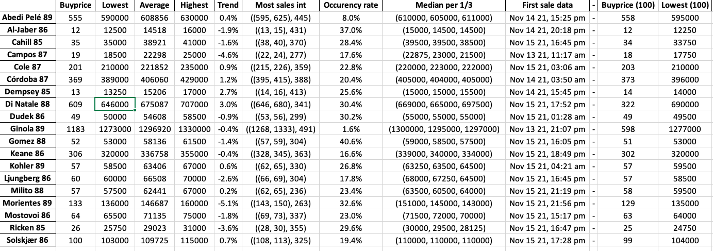

# Futbin have upgraded their security! DOES NOT WORK ANYMORE

# Futbin Price Finder
A price finder which gets the last 500 sales of players and calculate buy prices, and looks at other data which is useful

## Installation
Click on the green code button and click **Download ZIP**:


If you are not familiar with terminal/cmd, the easiest for you is to store the folder on your desktop.

1. Make sure you have **python3** installed.
2. If you are on:
    * Mac: open terminal
    * PC: cmd
    * Or other shells
3. All modules that can be installed by running this:
```console
cd Desktop/Futbin-price-updater/

pip install -r requirements.txt
```
Note: if you did not store this program on your desktop, change the *Desktop* part in the first line.


# How to use
## 1. You only have to do this first step once
Go to [futbin](https://www.futbin.com/22/players)'s player page and choose your own filters based on which players you want. You dont want to have too many players if you are going to learn all of their prices. I have selected all icons between 200 and 450'000 coins. My URL will look like this:


Copy your URL and open [findID.py](findID.py). Change your URL on line 16:
```python
URL = 'https://www.futbin.com/22/players?page=1&xbox_price=200-450000&version=icons'
```
~~Make sure it says /22/players... because it might be an error if not.~~ **Fixed**

You are now ready to run [findID.py](findID.py) using the terminal/cmd:
```console
python3 findID.py
```
When you run [findID.py](findID.py), you will be prompted to type in the name of the folder you want to create. In my instance i call it "icons450" because it's icons under 450k. This will create a new folder with a text- and excelfile. 

**Checklist:**
* Have a new folder
* Have a txt and excel file inside this folder
* txt file should look like this:
```txt
'Cole 85': 255354,
'Deco 85': 239027,
'Guardiola 85': 243782,
'Inzaghi 85': 239072,
'Koeman 85': 247303,
```

## 2. Find buy prices based on sales history (repeating step)
This is the part you have to do every time you want to update your prices.

Open [sales.py](sales.py) and change line 11, 12 and 13.
```python
platform = "xone"  # Xbox = xone,    Playstation = ps,   PC = pc
directory = "icons450"  # Change to directory you want to use (category)
want_pdf = 1 # Change to 1 if you want pdf with graphs, and 0 for no pdf
```
The directory should be set to the folder you want to use. I want to find the price of icons. You can set this to the folder you just created if you want. The idea is that you can create multiple groups of players. **Ex:** Icons under 450k, all hero cards, silvers etc... If you want to make a new group, follow step 1. You only have to follow step 1 if you want a new group/filter.

**Checklist:**
* You have a folder with a excel and txt file
* Changed line 11, 12 and 13 to your needs
* Followed the installation
* Your excel file is **NOT** open.

Now you are ready to run [sales.py](sales.py) by typing this in your terminal/cmd
```console
python3 sales.py
```

When the program is done, it will open your sheet for you.

# Result and examples


In the lowest, average and highest, the lowest and highest 2% of sales are omitted beacuse they are misleading. It removes the deviation.

Explaination (will use Gomez (line 12) as example):
* **Buy Price**: The buy price is calculated based on fluctuation and the average price.
* **Lowest**: The lowest sale.
* **Average**: The average of all sales.
* **Highest**: The highest sale.
* **Trend**: How much has a player gone up/down. Basically just the difference between first and second part of sales.
* **Most sales int**: Shows the 5% interval of most sales. Basically shows ((low, high), how many sales in between this interval). *Ex*: (57,59) is where Gomez has most sales. 304 sales happend in this interval. You can look at this to figure out where most sales happen. You can set the "high" price to your sell price but I want you to look at the *Occurency rate* before you sell.
* **Occurency rate**: Shows how many percent of sales happened at the highest price or over in the interval in last column. If this is high, you can easily sell over the interval price. *Ex*: Gomez ha 40.6% of sales at 59k and higher. Easy to sell at 59k then.
* **Median per 1/3**: Just the median value of each third of sales. Can be useful to look at to see if a player is on a donwfall or what his median price is for the last third. Don't look at this that much.
* **First sale data**: Since when is data collected from. This is useful to look at if it has been a market crash since that date.
* **-**: Splits the sheet in two, now comes the second part.
* **Second part**: This is the same but for the last 100 sales. I use this often because its the most recent data.

## Shortest explenation / summary
If you dont have a group of players or want a new one:
* Make your filter on futbin, copy link and paste on line 16 in [FindID.py](findID.py)
* Run [FindID.py](findID.py)

Every time you want to update players' prices:
* Change line 11, 12 and 13 in [sales.py](sales.py) to your platform and folder.
*  Run [sales.py](sales.py)
