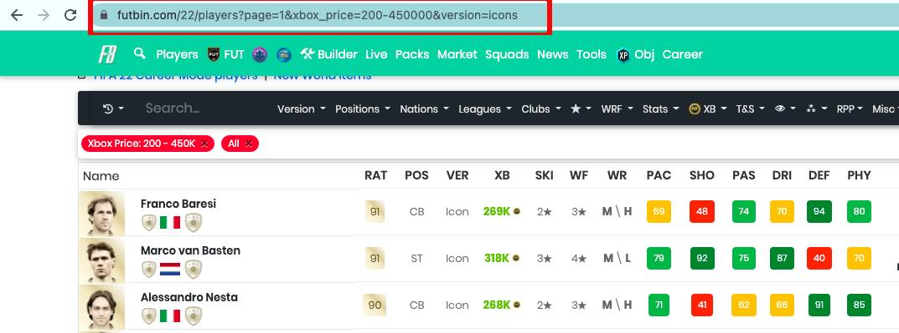
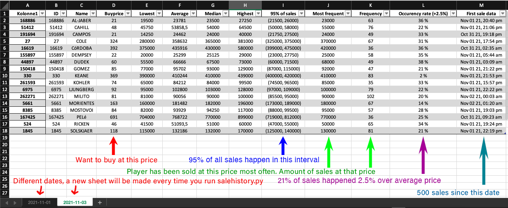

# Futbin price finder
A price finder which gets the last 500 sales of players and calculate buy prices, and looks at other data which is useful

## Installation
Begin by cloning the repository using your **console**:
```console
git clone https://github.com/fskickz/Futbin-price-updater.git
````
Install the required modules:
```console
pip install -r requirements.txt
```

## How to use
### 1. You only have to do this once
Go to [futbin](https://www.futbin.com/22/players)'s player page and choose your own filters based on which players you want. You dont want to have too many players if you are going to learn all of their prices. I have selected all icons between 200 and 450'000 coins. My URL will look like this:



Copy your URL and open [findID.py](findID.py). Change your URL on line 16
```python
URL = 'https://www.futbin.com/22/players?page=1&xbox_price=200-450000&version=icons'
```
You are now ready to run [findID.py](findID.py) using the console:
```console
python3 findID.py
```
When you run [findID.py](findID.py), you will be prompted to type in the name of the directory you want to create. In my instance i call it "icons450" because it's icons under 450k. This will create a new directory with a text- and excelfile. 

**Checklist:**
* Have a new directory
* Have a txt and excel file
* txt file should look like this:
```txt
'Deco 85': 239027,
'Cole 85': 255354,
'Guardiola 85': 243782,
'Inzaghi 85': 239072,
'Koeman 85': 247303,
```

### 2. Find buy prices based on sales history
Open [salehistory.py](salehistory.py) and change line 11 and 12.
```python
platform = "xone"  # Xbox = xone,    Playstation = ps,   PC = pc
directory = "icons450"  # Change to directory you want to use (category)
```
The directory should be set to the directory you want to use. I want to find the price of icons. You can set this to the directory you just created if you want. The idea is that you can create multiple groups of players. **Ex:** Icons under 450k, all hero cards, silvers etc... If you want to make a new group, follow step 1. You only have to follow step 1 if you want a new group/filter.

**Checklist:**
* You have a directory with a excel and txt file
* Changed line 11 and 12 to your needs
* Followed the installation

Now you are ready to run [salehistory.py](salehistory.py) by typing
```console
python3 salehistory.py
```
in your console

When the program is done, you can open your excel file and enjoy your brand new price sheet.

## Result and examples


Explaination:
* **Buy Price**: The buy price is 90% of the average price. This is because we want to earn 5% after tax.
* **Lowest**: The lowest sale. This can be very low, so we don't want to look at this too much because it is misleading.
* **Average**: The average of all sales.
* **Median**: Median of sales.
* **Highest**: The highest sale. This can also be very high, so we don't want to look at this one too much either.
* **95% of sales**: This is what we want to look at. This is an interval that shows where 95% of the sales occur. That means that the lowest 2.5% of sales will be omitted, and also the highest 2.5% of sales will be omitted.
* **Most frequent**: Player has been sold at this price the most. This can be set as your sell price but I want you to look at the *Occurency rate* before you sell.
* **Frequency**: How many times it has been sold at the most frequent sale price.
* **Occurency rate(2,5%)**: Shows how many percentage of sales happened at average times 2.5%. Example: ```average = 100'000``` then it will show how many percent of sales occured at 102.5k or above. This is useful to look at if you want to sell at a price higher than average. 
* [First sale data](https://github.com/fskickz/Futbin-price-updater): 500 sales has been made since this date. This is useful to look at if has been a market crash since that date.